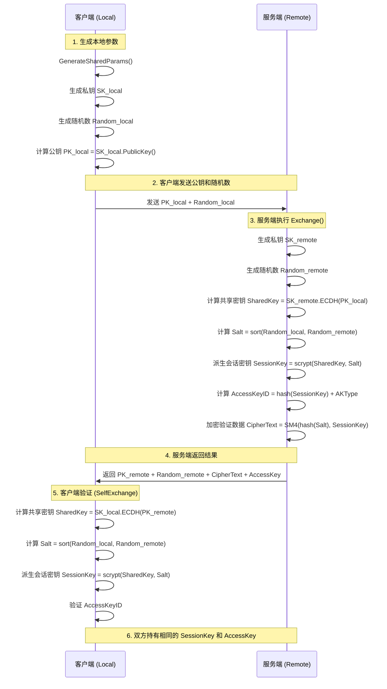

```mermaid
sequenceDiagram
    participant Client as 客户端 (Local)
    participant Server as 服务端 (Remote)
    
    Note over Client: 1. 生成本地参数
    Client->>Client: GenerateSharedParams()
    Client->>Client: 生成私钥 SK_local
    Client->>Client: 生成随机数 Random_local
    Client->>Client: 计算公钥 PK_local = SK_local.PublicKey()
    
    Note over Client,Server: 2. 客户端发送公钥和随机数
    Client->>Server: 发送 PK_local + Random_local
    
    Note over Server: 3. 服务端执行 Exchange()
    Server->>Server: 生成私钥 SK_remote
    Server->>Server: 生成随机数 Random_remote
    Server->>Server: 计算共享密钥 SharedKey = SK_remote.ECDH(PK_local)
    Server->>Server: 计算 Salt = sort(Random_local, Random_remote)
    Server->>Server: 派生会话密钥 SessionKey = scrypt(SharedKey, Salt)
    Server->>Server: 计算 AccessKeyID = hash(SessionKey) + AKType
    Server->>Server: 加密验证数据 CipherText = SM4(hash(Salt), SessionKey)
    
    Note over Client,Server: 4. 服务端返回结果
    Server->>Client: 返回 PK_remote + Random_remote + CipherText + AccessKey
    
    Note over Client: 5. 客户端验证 (SelfExchange)
    Client->>Client: 计算共享密钥 SharedKey = SK_local.ECDH(PK_remote)
    Client->>Client: 计算 Salt = sort(Random_local, Random_remote)
    Client->>Client: 派生会话密钥 SessionKey = scrypt(SharedKey, Salt)
    Client->>Client: 验证 AccessKeyID
    
    Note over Client,Server: 6. 双方持有相同的 SessionKey 和 AccessKey
```