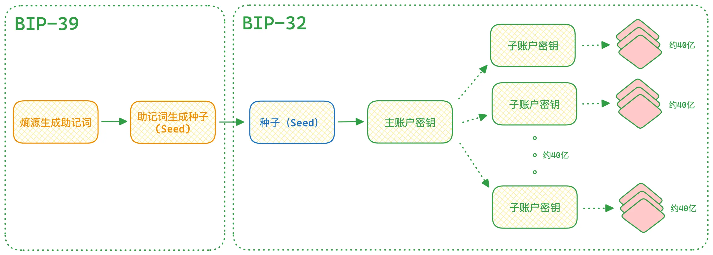

# Mnemonic

```shell
go get github.com/ethereum/go-ethereum/crypto
go get github.com/tyler-smith/go-bip32
go get github.com/tyler-smith/go-bip39
```

## BIP32
BIP-32 提出了分层确定性钱包（HD Wallet）的标准，它允许从单个种子（Seed）生成一系列相关的密钥对，包括一个主账户密钥和无限多个子账户密钥，不同的子账户之间具有层次关系，形成以主账户为根结点的树形结构。


```go
// 由种子生成主账户私钥
masterKey, _ := bip32.NewMasterKey(seed)
```
> + **分层**: 因为是树形结构，每一层都有一个序号（从 0 开始），主账户密钥 masterKey 序号是 0，以此类推，这个就叫做索引号（32 位）
> + **确定性**: 当通过单向哈希函数派生子密钥的时候，因为既想要随机，又希望同一个父密钥每次生成的子密钥都相同，于是，引入了链码来保证确定性，使得每次生成子密钥都是由父密钥+父链码+索引号三个一起派生子密钥。
> + **钱包**: 对应着密钥（私钥+公钥）

HD Wallet 的所有账户都是由**密钥**（公钥和私钥）, **链码**, **索引号**（32 位）三个部分组成的。当派生子密钥的时候，单独的私钥是不行的，必须是私钥和链码一起才能派生对应索引的子私钥，因此私钥和链码一起也叫做扩展私钥（xprv9tyUQV64JT...），因为是可扩展的。同样的，公钥和链码一起叫做扩展公钥（xpub67xpozcx8p...）。
```go
// 由主账户私钥生成子账户私钥
// @参数 索引号
childKey1, _ := masterKey.NewChildKey(1)
childKey2, _ := masterKey.NewChildKey(2)
```
### 链码
HD钱包的根密钥对（_master key pair_）是从一个随机的种子 <sub>seed</sub> 生成的。使用 _HMAC-SHA512_ 哈希函数，对种子进行哈希运算，生成一个 512 位的哈希值。
将这个 512 位的哈希值分成两部分：前 256 位作为主私钥（master private key），后 256 位作为主链码（master chain code）。

### 普通派生
通过父公钥和链码生成子公钥。

```shell
扩展公钥（公钥 + 链码） ==> 子公钥， 子私钥另外由父私钥派生出。
```

#### 风险
比如子私钥泄露，那攻击者会利用子私钥与子链码来推断父公钥。

### 强化派生
通过父私钥和链码生成子私钥，无法通过父公钥派生。

```shell
扩展私钥（私钥 + 链码） ==> 子私钥 ==> 子公钥
```

> HD Wallet 规定：索引号在 0 和 2^31–1(0x0 to 0x7FFFFFFF)之间的只用于常规派生。索引号在 2^31 和 2^32– 1(0x80000000 to 0xFFFFFFFF)之间的只用于强化派生。强化派生密钥右上角有一个小撇号，如：索引号为 0x80000000 就表示为 0'

## BIP39
+ 由熵源生成助记词
+ 由助记词生成种子(Seed)

```go
// 由熵源生成助记词
// @参数 128 => 12个单词
// @参数 256 => 24个单词
entropy, _ := bip39.NewEntropy(128)
mnemonic, _ := bip39.NewMnemonic(entropy)
fmt.Println("助记词：", mnemonic)

// 由助记词生成种子(Seed)
seed := bip39.NewSeed(mnemonic, "salt")
```

生成 seed 时，第二个参数salt是可选参数：盐值（也叫密码口令 _passphrase_）。有 2 个目的，一是增加暴力破解的难度，二是保护种子（seed），即使助记词被盗，种子也是安全的。如果设置了salt，虽然多了一层保护，但是一旦忘记，就永久丢失了钱包。

## BIP44
BIP-44 标准的钱包路径： `m / purpose' / coin_type' / account' / change / address_index`

| 符号            | 意思                                                                                      |
|---------------|-----------------------------------------------------------------------------------------|
| m             | 标记子账户都是由主私钥派生的                                                                          |
| purpose'      | 标记是 BIP-44 标准，固定值 44'                                                                   |
| coin_type'    | 标记币种，以太坊是 60'，[查看完整币种类型](https://github.com/satoshilabs/slips/blob/master/slip-0044.md) |
| account'      | 标记账户类型，从 0' 开始，用于给账户分类                                                                  |
| change        | 0 表示外部可见地址，1 表示找零地址（外部不可见），默认我为 0                                                       |
| address_index | 地址索引                                                                                    |


### 实现
```shell
// 以太坊的币种类型是60
// FirstHardenedChild = uint32(0x80000000) 是一个常量
// 以路径（path: "m/44'/60'/0'/0/0"）为例
key, _ := masterKey.NewChildKey(bip32.FirstHardenedChild + 44)  // 强化派生 对应 purpose'
key, _ = key.NewChildKey(bip32.FirstHardenedChild + uint32(60)) // 强化派生 对应 coin_type'
key, _ = key.NewChildKey(bip32.FirstHardenedChild + uint32(0))  // 强化派生 对应 account'
key, _ = key.NewChildKey(uint32(0)) // 常规派生 对应 change
key, _ = key.NewChildKey(uint32(0)) // 常规派生 对应 address_index

// 生成地址
pubKey, _ := crypto.DecompressPubkey(key.PublicKey().Key)
addr := crypto.PubkeyToAddress(*pubKey).Hex()
```
